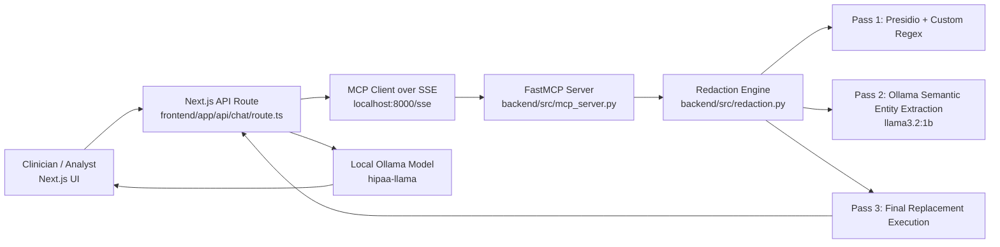

# Praxis Shield

Praxis Shield is a local-first clinical redaction and analysis system designed to protect PHI/PII before language-model processing. It combines deterministic pattern matching, NLP-based entity detection, and an MCP-enforced redaction gate so raw EHR-like text is scrubbed before downstream summarization.

The project is built as a full stack application:

- Frontend UI: Next.js chat console for clinicians/analysts.
- Secure gateway: Next.js API route that always calls MCP redaction first.
- Redaction engine: FastMCP tool backed by Presidio + custom regex + Ollama semantic pass.
- Clinical analysis model: Local Ollama model (`hipaa-llama`) for structured clinical summaries.

---

## Project Scope

### In Scope

- Accept free-form, raw clinical text payloads from a local UI.
- Redact direct and quasi-identifiers before any clinical reasoning.
- Enforce redaction via a tool-call boundary (`anonymize_patient_data`) in the request path.
- Generate clinician-facing, non-diagnostic technical summaries from redacted content.
- Run fully on local infrastructure (localhost services) to minimize data egress risk.

### Out of Scope

- Medical diagnosis or treatment decisions for patients.
- Production-grade identity/access management.
- Audited legal compliance certification (HIPAA/DPDP claims still require formal controls).
- Multi-tenant cloud deployment and centralized observability.

---

## Architecture

## High-Level View



## Runtime Components

1. Frontend (Next.js App Router)
- Chat interface to submit raw EHR text.
- Streams model output back to user.

2. API Proxy Layer
- Receives chat messages.
- Extracts latest user text from message parts.
- Calls MCP tool first to redact.
- Rewrites user payload with scrubbed text.
- Forwards only redacted content to the clinical LLM.

3. MCP Redaction Service
- Exposes `anonymize_patient_data(text)` tool.
- Encapsulates redaction policy in one callable boundary.

4. Redaction Pipeline
- Deterministic patterns (`score=1.0`) for IDs, phone numbers, PIN/ZIP, Aadhaar, PAN, dates, and address fragments.
- Presidio NER for entities like PERSON, LOCATION, PHONE_NUMBER, EMAIL_ADDRESS.
- Semantic extraction via local Ollama (`llama3.2:1b`) for facility/address entities that regex/NER may miss.
- Final text replacement to `[REDACTED]`.

5. Clinical Summarization Model
- Local Ollama model alias `hipaa-llama` built from the provided GGUF + Modelfile template.
- System prompt constrained to clinician-facing analysis and missing-data acknowledgment.

---

## End-to-End Data Flow

1. User pastes raw clinical payload in the web UI.
2. Frontend sends the message to `/api/chat`.
3. API route opens MCP SSE connection to local FastMCP server.
4. API calls `anonymize_patient_data` with raw input.
5. Backend redaction pipeline performs deterministic + semantic cleaning.
6. Redacted text is returned to API route.
7. API replaces original user text with scrubbed text.
8. Redacted message is sent to local `hipaa-llama`.
9. Streamed response is returned to UI.

Key invariant: raw text should not be sent to the clinical model without passing through MCP redaction.

---

## Repository Layout

```text
hipaa-shield/
	backend/
		src/
			mcp_server.py         # FastMCP tool server
			redaction.py          # Multi-pass redaction logic
		Modelfile               # Ollama model template for hipaa-llama
		llama-3.2-3b-instruct.Q4_K_M.gguf
		generate_dataset.py     # Synthetic dataset generation utility
		unsloth_medical_dataset.jsonl

	frontend/
		app/
			page.tsx              # Chat UI
			api/chat/route.ts     # Redaction-enforced LLM proxy
```

---

## Tech Stack

- Frontend: Next.js 16, React 19, TypeScript, Tailwind CSS.
- LLM Gateway: Vercel AI SDK + OpenAI-compatible Ollama endpoint.
- Tooling Protocol: Model Context Protocol (MCP) over SSE.
- Backend: Python FastMCP.
- Redaction: Microsoft Presidio + custom regex recognizers + semantic extraction pass.
- Local model host: Ollama.

---

## Local Setup

## Prerequisites

- Python 3.10+ (recommended).
- Node.js 18+ (Node 20+ recommended).
- Ollama running locally.
- Git + PowerShell/Bash shell.

## 1) Start Ollama and create the model alias

From `backend/`:

```bash
ollama create hipaa-llama -f Modelfile
```

Ensure Ollama is serving on `http://127.0.0.1:11434`.

## 2) Start backend MCP server

From `backend/` (inside virtual environment):

```bash
pip install fastmcp presidio-analyzer presidio-anonymizer requests python-dotenv groq
python src/mcp_server.py
```

The server listens via SSE transport (default local endpoint at port 8000).

## 3) Start frontend app

From `frontend/`:

```bash
npm install
npm run dev
```

Open `http://localhost:3000`.

---

## Dataset and Training Utilities

- `backend/generate_dataset.py` creates synthetic redacted EHR + summary pairs for fine-tuning style datasets.
- Output is appended to `backend/unsloth_medical_dataset.jsonl` in Alpaca-style format (`instruction`, `input`, `output`).

Note: This utility uses Groq API credentials from environment variables (`GROQ_API_KEY`).

---

## Safety and Compliance Notes

- The project enforces a redaction-first architecture, but deployment compliance still depends on:
	- infrastructure hardening,
	- access controls,
	- audit logs,
	- data retention policy,
	- legal/privacy review.
- Redaction quality is probabilistic for some entities; false negatives remain possible.
- Clinical summaries are assistive documentation outputs, not medical diagnosis.

---

## Current Limitations

- No automated regression suite for redaction accuracy by entity class.
- Address/facility extraction quality depends on local semantic model behavior.
- Limited explicit locale coverage beyond currently coded US/India-centric patterns.
- No packaged deployment scripts (Docker/Compose/K8s) in this repository.

---

## Suggested Next Milestones

1. Add entity-level redaction benchmark tests with precision/recall tracking.
2. Add deterministic redaction audit logs (hash + span metadata, not raw text).
3. Introduce policy profiles per region (HIPAA/DPDP/GDPR variants).
4. Add containerized local deployment and health-check orchestration.
5. Add role-based access and signed prompt/output traceability.

---

## Mission Statement

Praxis Shield aims to make clinical AI workflows safer by enforcing privacy controls before language-model inference, while preserving enough clinical signal for useful professional summarization.
